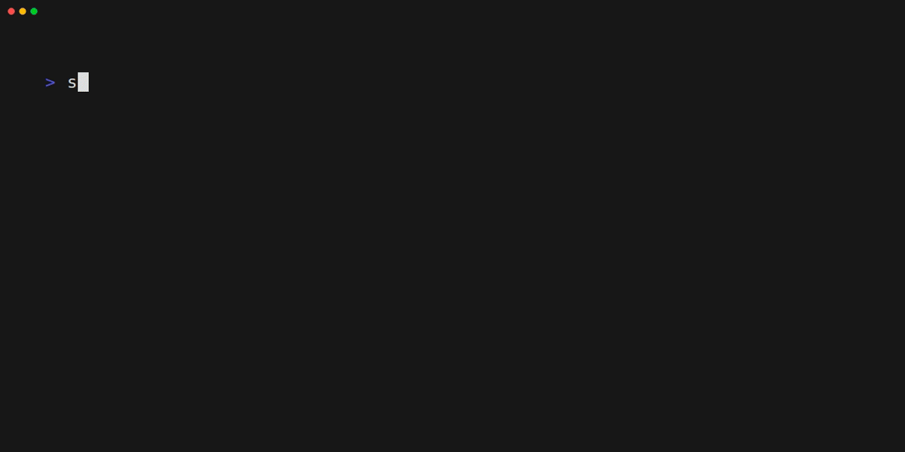

# songlinkrr

## ☕ About
Songlinkrr is a CLI tool to to create shareable links for your currently playing plex songs using subsonic.  
It searches your active plex sessions for music streams and tries to find matching tracks on subsonic for the songs that are played.  
That allows you to conveniently share songs with friends and family.

## 🚀 Installation
```
# using go directly
$ go install github.com/jon4hz/songlinkrr@latest

# from aur (btw)
$ yay -S songlinkrr-bin

# local pkg manager
$ export VERSION=v0.1.0

## debian / ubuntu
$ dpkg -i songlinkrr-$VERSION-linux-amd64.deb

## rhel / sles
$ rpm -i songlinkrr-$VERSION-linux-amd64.rpm

## alpine
$ apk add --allow-untrusted songlinkrr-$VERSION-linux-amd64.apk
```
All releases can be found [here](https://github.com/jon4hz/songlinkrr/releases)

## 📝 Config
Songlinkrr searches for a config file in the following locations:

1. `./songlinkrr.yml`
2. `~/.config/songlinkrr/songlinkrr.yml`
3. `/etc/songlinkrr/songlinkrr.yml`

First come first serve, if you dont like that, use the `--config` flag to specify an exact location.

### 🤯 Example
```yaml
---
plex_username: your_plex_user
plex_token: your_plex_token
plex_url: https://my.plex.server
plex_ignore_tls: true  # in most cases your cert wont be valid.
subsonic_url: https://my.subsonic.server
subsonic_user: your_username
subsonic_password: your_password
```

## ✨ Usage
```
$ songlinkrr --help
Songlinkrr is a CLI tool to get song links for your currently playing song on Plex

Usage:
  songlinkrr [flags]

Flags:
  -c, --config string   path to the config file
  -f, --force-confirm   force confirmation of the song
  -h, --help            help for songlinkrr
```

## 🥁 Demo

